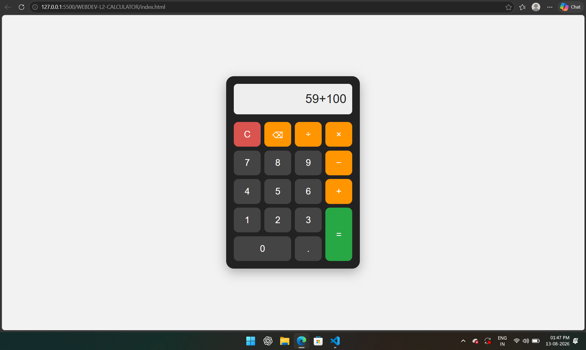

# Calculator Web Application

This is a simple **browser-based Calculator** built using **HTML5, CSS3, and Vanilla JavaScript**. The calculator performs basic arithmetic operations through a simple and user-friendly button interface.

I built this project to practice **JavaScript, DOM manipulation, event handling, CSS Grid, and arithmetic logic** without using `eval()`.

## Features

* Basic arithmetic operations
* Addition (+)
* Subtraction (-)
* Multiplication (×)
* Division (÷)
* Decimal number support
* Display for current input and result
* Clear (C) button
* Backspace (⌫) button
* Equals (=) button
* Operator chaining
* Correct operator precedence
* Division-by-zero error handling
* Keyboard support
* Responsive user interface
* CSS Grid for button layout
* Event listeners on all buttons
* No inline `onclick` attributes
* No use of `eval()`

## Technologies Used

* HTML5
* CSS3
* JavaScript (Vanilla)
* CSS Grid
* DOM API
* JavaScript Event Listeners

## Project Structure

```text
Calculator/
│── index.html
│── style.css
│── script.js
└── README.md
```

## How to Run

1. Download or clone the repository.
2. Open the project folder.
3. Open `index.html` in any modern web browser.
4. Use the calculator buttons to perform calculations.

No additional installation or dependencies are required.

## Calculator Operations

The calculator supports the following operations:

```text
Addition       → 5 + 3 = 8
Subtraction    → 8 - 3 = 5
Multiplication → 5 × 3 = 15
Division       → 10 ÷ 2 = 5
Decimal        → 5.5 + 2.5 = 8
```

The calculator also supports operator chaining.

Example:

```text
5 + 3 × 2 = 11
```

The calculator follows normal arithmetic operator precedence.

## Error Handling

The calculator prevents invalid operations such as division by zero.

Example:

```text
10 ÷ 0
```

Displays:

```text
Cannot divide by zero
```

instead of crashing the application.

## Keyboard Support

The calculator can also be operated using the keyboard.

| Key         | Function              |
| ----------- | --------------------- |
| `0–9`       | Numbers               |
| `+`         | Addition              |
| `-`         | Subtraction           |
| `*`         | Multiplication        |
| `/`         | Division              |
| `.`         | Decimal               |
| `Enter`     | Calculate             |
| `Backspace` | Delete last character |
| `Escape`    | Clear                 |

## What I Learned

While building this project, I learned how to:

* Create a calculator interface using HTML and CSS
* Use CSS Grid for button alignment
* Handle button clicks using JavaScript event listeners
* Manipulate HTML elements using the DOM
* Perform arithmetic operations using JavaScript
* Implement operator precedence
* Handle invalid input and division by zero
* Add keyboard functionality
* Avoid using `eval()` for calculations
* Create a responsive web interface

## Future Improvements

* Add calculation history
* Add dark/light theme switching
* Add scientific calculator functions
* Add percentage calculation
* Add memory functions
* Improve animations and UI design
* Add sound effects for button clicks

## Screenshots

Add your project screenshot to the repository and use the following:

```markdown

```

## Author

**Hemanth Kumar**
