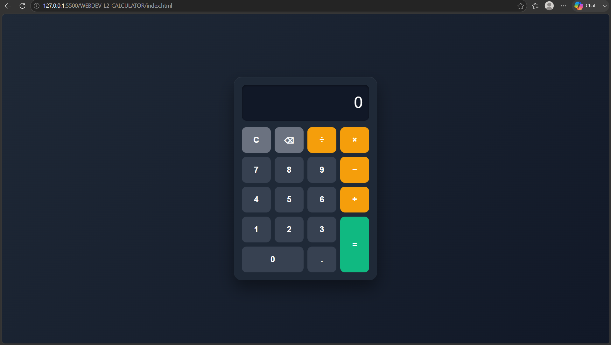

# 🧮 Calculator

A fully functional **browser-based calculator** built with **HTML5, CSS3, and Vanilla JavaScript**. It provides a clean and user-friendly interface for performing basic arithmetic operations.

## ✨ Features

* Perform **addition, subtraction, multiplication, and division**
* Supports **decimal numbers**
* **Clear** button to reset the calculator
* **Backspace** button to remove the last entered character
* **Equals** button to calculate the result
* Handles **division by zero** with an error message
* Supports **sequential calculations**
* Uses **CSS Grid** for button alignment
* Uses JavaScript **event listeners** for all buttons
* Built without using `eval()`

## 🛠️ Technologies Used

* HTML5
* CSS3
* Vanilla JavaScript

## 📁 Project Structure

```text
Calculator/
│
├── index.html
├── style.css
├── script.js
└── README.md
```

## 🚀 How to Run

1. Clone this repository:

```bash
git clone https://github.com/your-username/calculator.git
```

2. Open the project folder.
3. Open `index.html` in any modern web browser.
4. Start using the calculator.

## 🧮 Supported Operations

| Operation      | Example      |
| -------------- | ------------ |
| Addition       | `5 + 3 = 8`  |
| Subtraction    | `8 - 3 = 5`  |
| Multiplication | `5 × 3 = 15` |
| Division       | `15 ÷ 3 = 5` |

## 📸 Screenshot

```markdown

```

## 🎯 Project Objective

The objective of this project is to build a simple and interactive calculator while practicing:

* HTML page structure
* CSS styling and Grid layout
* JavaScript variables and conditions
* DOM manipulation
* Event handling

## 👨‍💻 Author

**Your Name**
