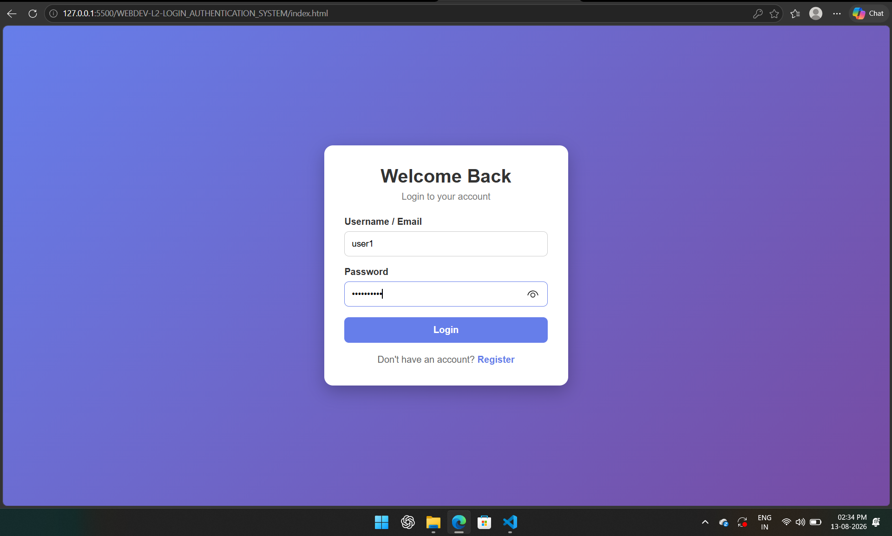
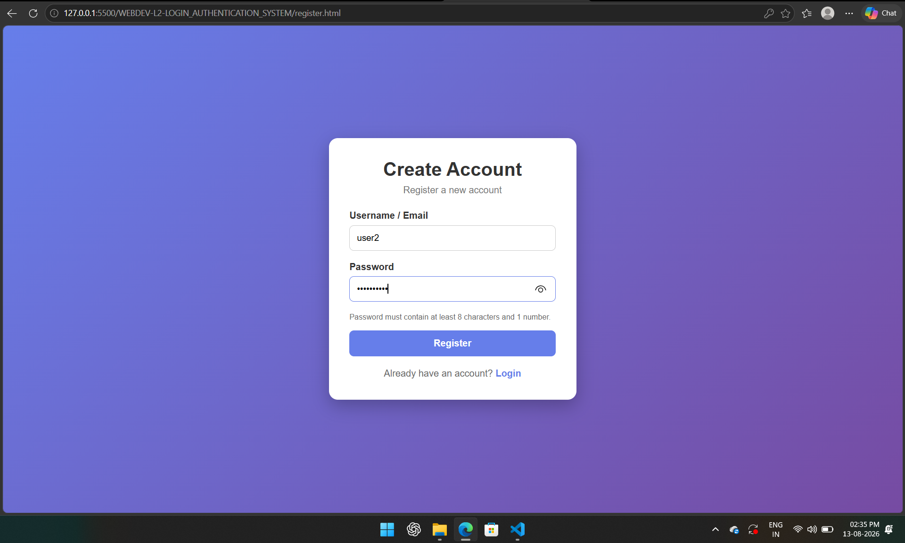
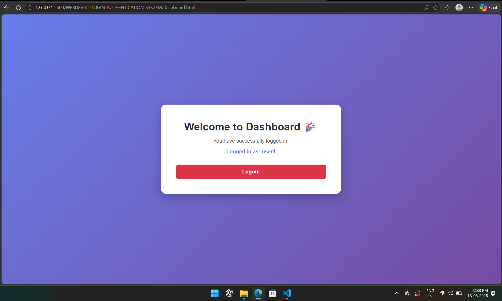

# Login Authentication System

A simple client-side **Login Authentication System** built using **HTML, CSS, and JavaScript** with `localStorage`. This project provides user registration, login validation, password protection, and access to a protected dashboard.

## 🚀 Objective

Build a simple authentication system featuring:

* User registration
* Login validation
* Password validation
* Protected dashboard access
* Logout functionality
* Client-side session management

## 🛠️ Tech Stack

* **HTML5** – Page structure
* **CSS3** – Styling and layout
* **JavaScript** – Authentication and validation
* **localStorage** – Store user data and session information
* **SHA-256** – Basic client-side password hashing

## 📂 Project Structure

```text
WEBDEV-L2-LOGIN_AUTHENTICATION_SYSTEM/
│
├── dashboard.html
├── index.html
├── register.html
├── script.js
├── style.css
│
├── LoginAuthSS1.png
├── LoginAuthSS2.png
└── LoginAuthSS3.png
```

## ✨ Features

* [x] Registration page with username/email and password fields
* [x] Password validation with minimum 8 characters
* [x] Password must contain at least 1 number
* [x] Duplicate username/email detection
* [x] Login page with username/email and password
* [x] Clear error message for incorrect credentials
* [x] Protected dashboard page
* [x] Redirect to login when dashboard is accessed without authentication
* [x] Logout button
* [x] Session management using `localStorage`
* [x] Passwords are not stored directly as plain text
* [x] Basic form validation on registration and login

## 🔐 Authentication Flow

```text
Register
   ↓
Validate User Details
   ↓
Hash Password
   ↓
Store User Data
   ↓
Login
   ↓
Validate Credentials
   ↓
Create Session
   ↓
Dashboard
   ↓
Logout → Login Page
```

## 📸 Screenshots

### Login Page



### Registration Page



### Dashboard Page



## ▶️ How to Run

1. Download or clone this repository.
2. Open the project folder in **VS Code**.
3. Open `index.html` in your browser.
4. Register a new account.
5. Login using the registered credentials.
6. Access the protected dashboard.
7. Click **Logout** to end the session.

## 📌 Files Description

| File               | Description                         |
| ------------------ | ----------------------------------- |
| `index.html`       | Login page                          |
| `register.html`    | User registration page              |
| `dashboard.html`   | Protected dashboard                 |
| `script.js`        | Authentication and validation logic |
| `style.css`        | Website styling                     |
| `LoginAuthSS1.png` | Registration screenshot             |
| `LoginAuthSS2.png` | Login screenshot                    |
| `LoginAuthSS3.png` | Dashboard screenshot                |


## 👨‍💻 Author

**Hemanth Kumar**
