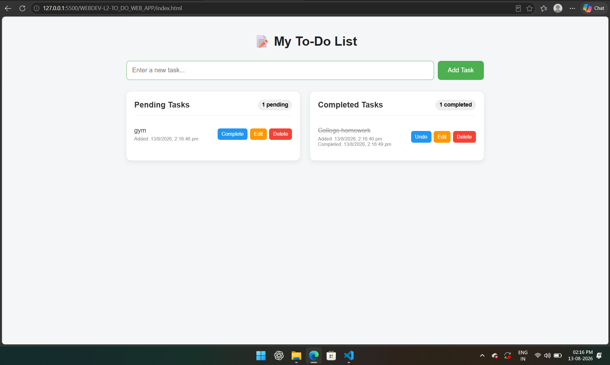

# To-Do Web App

This is an interactive **To-Do Web Application** built using **HTML5, CSS3, and Vanilla JavaScript**. The application allows users to manage their daily tasks by adding, completing, editing, and deleting tasks. Tasks are organized into separate **Pending Tasks** and **Completed Tasks** lists.

I built this project to practice **JavaScript DOM manipulation, event handling, localStorage, dynamic content creation, and responsive web design**.

## Features

* Add new tasks
* Display newly added tasks in the Pending Tasks list
* Mark tasks as completed
* Move completed tasks to the Completed Tasks list
* Edit task text inline
* Delete tasks permanently
* Display pending and completed task counts
* Show timestamps for tasks
* Save tasks using localStorage
* Tasks remain available after refreshing the page
* Friendly empty-state messages
* Responsive and clean user interface

## Technologies Used

* HTML5
* CSS3
* JavaScript (Vanilla)
* DOM Manipulation
* localStorage
* JavaScript Event Listeners

## Project Structure

```text
WEBDEV-L2-TO_DO_WEB_APP/
│── index.html
│── style.css
│── script.js
│── ToDoWebApp.png
└── README.md
```

## How to Run

1. Download or clone the repository.
2. Open the `WEBDEV-L2-TO_DO_WEB_APP` folder.
3. Open `index.html` in any modern web browser.
4. Enter a task in the input field.
5. Click **Add Task** to add it to the Pending Tasks list.

No additional installation or dependencies are required.

## How It Works

### Add Task

Enter a task in the input field and click **Add Task**. The new task will immediately appear in the **Pending Tasks** section.

### Mark Complete

Each pending task has a **Mark Complete** option. When clicked, the task moves from the Pending Tasks list to the **Completed Tasks** list.

### Edit Task

The **Edit** button allows users to modify the task text directly.

### Delete Task

The **Delete** button permanently removes the task from the application.

### Task Counters

The application displays the number of:

* Pending tasks
* Completed tasks

The counters update automatically whenever a task is added, completed, edited, or deleted.

### Timestamps

Each task displays a timestamp showing when the task was added and/or completed.

### Local Storage

Tasks are stored using **localStorage**, allowing them to remain available even after refreshing or reopening the page.

## Empty State

When there are no tasks in a particular list, the application displays a friendly message instead of leaving the section empty.

## What I Learned

While building this project, I learned how to:

* Create an interactive webpage using HTML, CSS, and JavaScript
* Manipulate HTML elements using the DOM
* Handle user actions with JavaScript event listeners
* Dynamically create and update task elements
* Implement add, edit, complete, and delete functionality
* Use localStorage to save application data
* Update task counters dynamically
* Handle empty states
* Work with timestamps in JavaScript
* Create a responsive web application

## Future Improvements

* Add task categories
* Add task priority levels
* Add due dates and reminders
* Add search and filter functionality
* Add dark/light mode
* Add drag-and-drop task sorting
* Add notifications for upcoming tasks
* Add user authentication

## Screenshots



## Author

**Hemanth Kumar**
