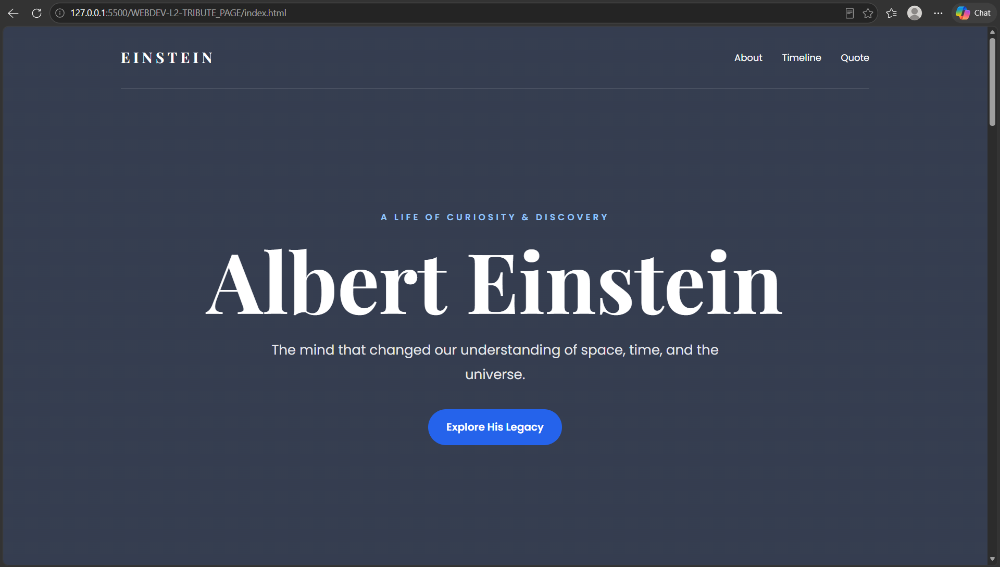
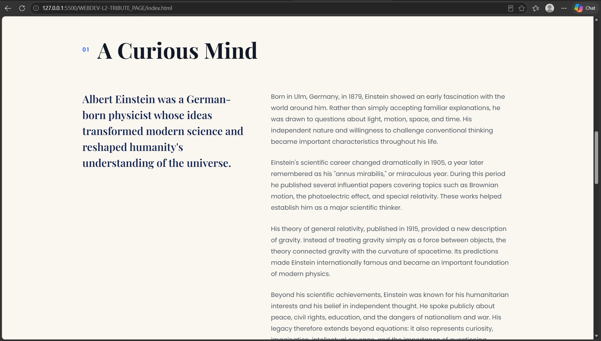
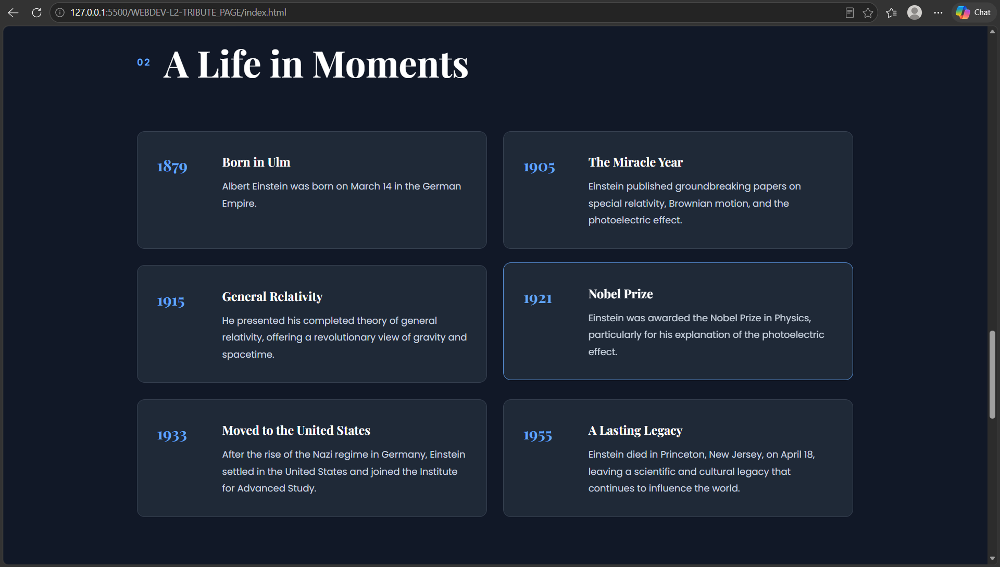
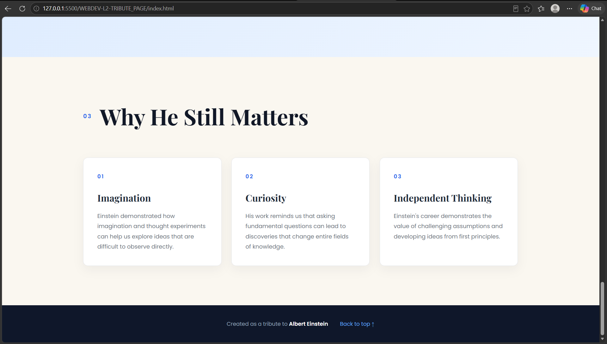

# Tribute Page

This is a visually engaging **Tribute Page** built using **HTML5 and CSS3**. The page is dedicated to a notable personality and presents their biography, achievements, important events, and an inspirational quote in a clean and responsive design.

I built this project to practice **HTML structure, CSS styling, responsive layouts, typography, and creating visually appealing web pages**.

## Features

* Tribute page dedicated to a notable personality
* Page title with the subject's name
* One-line tagline
* Prominent image
* Biography and tribute section
* Timeline of important achievements
* Inspirational quote section
* Multiple background colors across sections
* Different font styles for headings and body content
* Responsive layout
* Clean and user-friendly interface

## Technologies Used

* HTML5
* CSS3
* Responsive Web Design

## Project Structure

```text
WEBDEV-L2-TRIBUTE_PAGE/
│── index.html
│── style.css
│── TributePageSS1.png
│── TributePageSS2.png
│── TributePageSS3.png
│── TributePageSS4.png
└── README.md
```

## How to Run

1. Download or clone the repository.
2. Open the `WEBDEV-L2-TRIBUTE_PAGE` folder.
3. Open `index.html` in any modern web browser.
4. The tribute page will be displayed in the browser.

No additional installation or dependencies are required.

## Page Sections

### Header

Contains the name of the subject along with a short tagline introducing the personality.

### Biography

Provides information about the subject's life, background, contributions, and achievements.

### Timeline

Displays important events and achievements in chronological order.

### Quote

Contains a notable or inspirational quote related to the subject with distinctive styling.

### Footer

Contains additional information about the page or subject.

## What I Learned

While building this project, I learned how to:

* Structure a webpage using HTML5
* Create different sections using semantic HTML
* Style webpages using CSS3
* Use different fonts for headings and body content
* Apply multiple background colors
* Create a visually attractive layout
* Design a responsive webpage
* Organize content using lists and sections
* Add and style images
* Create a timeline for important events

## Future Improvements

* Add JavaScript animations
* Add interactive timeline elements
* Add a navigation menu
* Improve mobile responsiveness
* Add more visual effects
* Add additional information about the subject
* Add social media or reference links

## Screenshots

### Screenshot 1



### Screenshot 2



### Screenshot 3



### Screenshot 4



## Author

**Hemanth Kumar**
